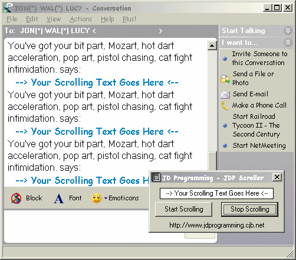



## \[ JD Programming \- JDP MSN Scroller \]

### Description

This will send the user multi messages with a click of a button, and the best part about it is it's under your control. It also works on the new MSN Messenger Version 5.0. Please vote for my program and leave your comments.

.:JamesJD:.
 
### More Info
 

             |
---                |---
**Submitted On**   |2002-11-11 12:11:20
**By**             |[JamesJD](https://github.com/Planet-Source-Code/PSCIndex/blob/master/ByAuthor/jamesjd.md)
**Level**          |Beginner
**User Rating**    |4.7 (14 globes from 3 users)
**Compatibility**  |VB 3\.0, VB 4\.0 \(16\-bit\), VB 4\.0 \(32\-bit\), VB 5\.0, VB 6\.0
**Category**       |[Internet/ HTML](https://github.com/Planet-Source-Code/PSCIndex/blob/master/ByCategory/internet-html__1-34.md)
**World**          |[Visual Basic](https://github.com/Planet-Source-Code/PSCIndex/blob/master/ByWorld/visual-basic.md)
**Archive File**   |[a\_\_\_\!\_\_\_a\_152157112003\.zip](https://github.com/Planet-Source-Code/jamesjd-jd-programming-jdp-msn-scroller__1-40619/archive/master.zip)

